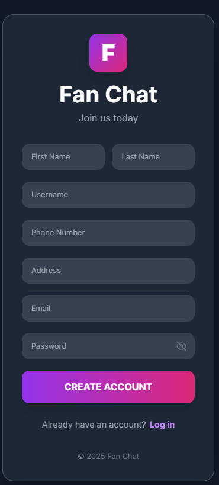
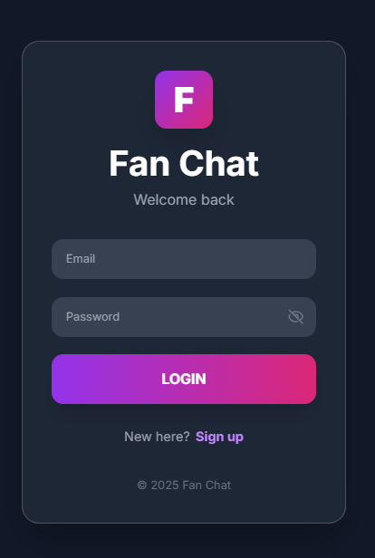
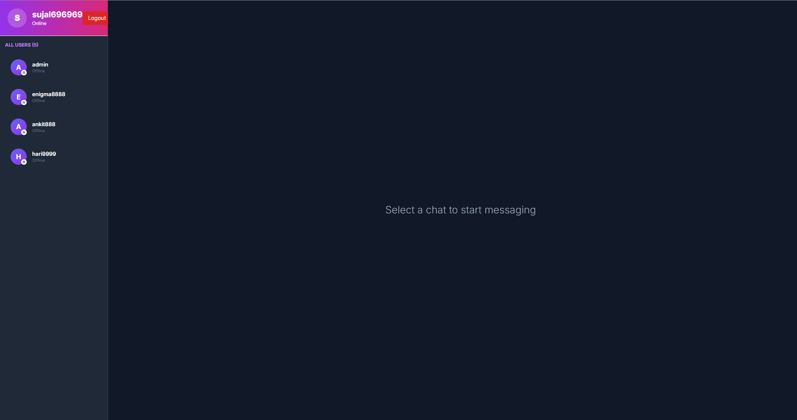
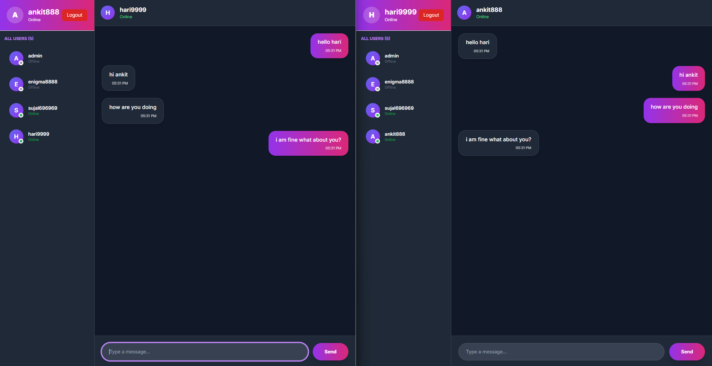
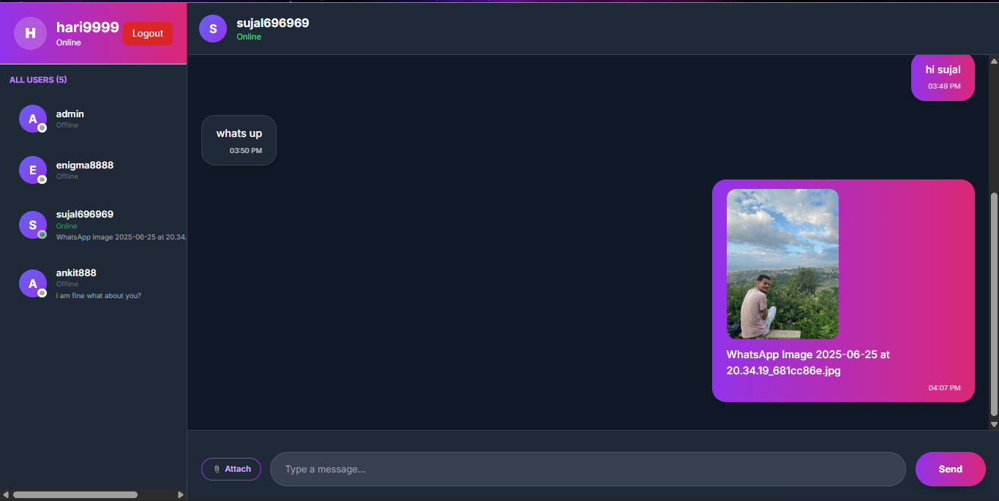
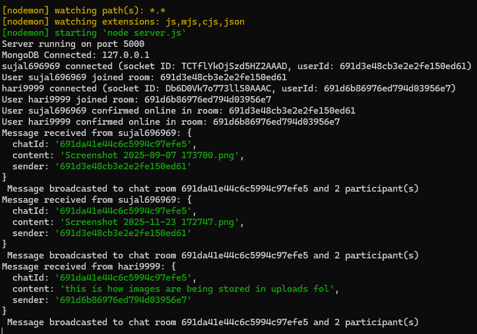
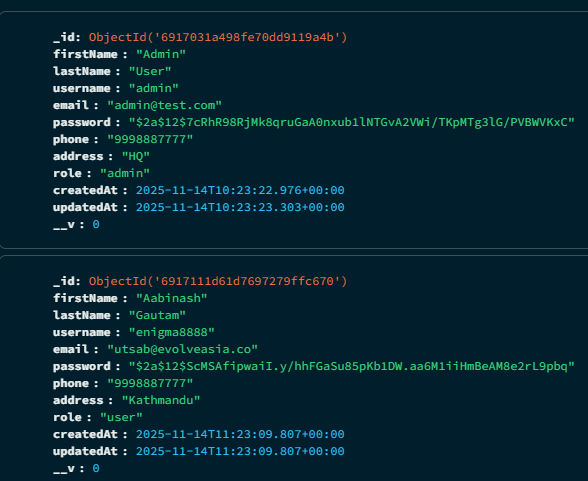
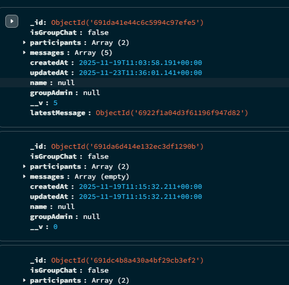

# Chat Application


A modern, full-stack real-time chat application with user authentication, WebSocket messaging, and dark mode support.

## 🚀 Features

- **Real-time Messaging** - Instant message delivery using Socket.io
- **User Authentication** - Secure register/login with JWT
- **Online Status** - See who's online in real-time
- **Dark Mode** - Toggle between light and dark themes
- **Responsive Design** - Works on desktop and mobile
- **Protected Routes** - Secure access to chat features
- **Message History** - View past conversations

## 📋 Tech Stack

### Backend

- Node.js & Express.js
- MongoDB with Mongoose
- Socket.io for real-time communication
- JWT for authentication
- bcryptjs for password hashing

### Frontend

- React 19
- Tailwind CSS
- Socket.io Client
- Axios for API calls
- React Router v7

## ⚡ Quick Start

### Prerequisites

- Node.js v18+
- MongoDB (local or Atlas)

### Installation

**Option 1: Automated Setup (Windows)**

```bash
setup.bat
```

**Option 2: Manual Setup**

1. **Backend**

   ```bash
   cd backend
   npm install
   # Create .env file with MongoDB URI and JWT secrets
   npm run dev
   ```

2. **Frontend**
   ```bash
   cd frontend
   npm install
   npm start
   ```

Frontend will open at `http://localhost:3000`

## 📚 Documentation

- **[backend/README.md](./backend/README.md)** - Backend documentation
- **[frontend/README.md](./frontend/README.md)** - Frontend documentation

## 📁 Project Structure

```
chat_app/
├── backend/              # Express server + Socket.io
│   ├── config/          # DB & Socket configuration
│   ├── controllers/     # Route controllers
│   ├── middleware/      # Auth & error handling
│   ├── models/          # MongoDB schemas
│   ├── routes/          # API endpoints
│   ├── tests/           # Backend test codes for auth, user and chats
│   ├── uploads/         # Contains uploaded images of chats
│   ├── .env.example     # Environment template
│   └── server.js        # Entry point
│
├── frontend/            # React application
│   ├── src/
│   │   ├── components/  # UI components
│   │   ├── context/     # State management
│   │   ├── pages/       # Full pages
│   │   ├── services/    # API & Socket utilities
│   │   └── App.jsx      # Root component
│   └── .env             # Environment variables
│
├── package.json         # complete documentation of project
└── README.md            # Complete setup guide
```

## 🔌 API Overview

### Authentication

- `POST /auth/register` - Create account
- `POST /auth/login` - Login
- `GET /auth/me` - Current user
- `POST /auth/logout` - Logout

### Chat

- `GET /users` - All users
- `POST /chat/create` - Start chat
- `GET /chat` - User's chats
- `GET /chat/:id/messages` - Messages

### WebSocket Events

- `user-online` - User comes online
- `send-message` - Send message
- `receive-message` - New message
- `online-users` - Online users list

## 🎨 Key Features Explained

### Real-time Messaging

1. User sends message via Socket.io
2. Server broadcasts to chat participants
3. All clients receive via WebSocket
4. UI updates instantly

### Authentication

1. User registers/logs in
2. JWT token created and stored locally
3. Token sent with all API requests
4. Socket.io authenticates with token

### Online Status

1. User emits `user-online` on connect
2. Server broadcasts updated list to all
3. UI shows green dot for online users
4. Updates when users disconnect

### Image Uploading Feature

1. Can send and receive image with message
2. Images will be stored in backend/upload

## 🛠️ Development

### Backend Development

```bash
cd backend
npm run dev              # Start with hot-reload
npm test               # Run tests
```

### Frontend Development

```bash
cd frontend
npm start              # Development server
npm run build          # Production build
```

## 📦 Environment Variables

### Backend (.env)

```env
MONGODB_URI=mongodb://localhost:27017/chat_app
JWT_SECRET=your_secret_key
REFRESH_TOKEN_SECRET=your_refresh_secret
PORT=5000
NODE_ENV=development
ALLOWED_ORIGINS=http://localhost:3000
```

### Frontend (.env)

```env
REACT_APP_API_URL=http://localhost:5000
```

## 🐛 Troubleshooting

### Backend Issues

- **Port already in use**: Change PORT in .env or kill process on port 5000
- **MongoDB connection failed**: Verify MONGODB_URI and MongoDB is running
- **Socket connection fails**: Check CORS settings and ALLOWED_ORIGINS

### Frontend Issues

- **Socket not connecting**: Ensure backend is running and REACT_APP_API_URL is correct
- **401 errors**: Clear localStorage and re-login
- **Messages not updating**: Check browser console and Socket.io connection

See [SETUP_GUIDE.md](./Setup_Guide.md) for more troubleshooting.

## 🚀 Deployment

### Backend

- Deploy to Heroku, AWS, or your preferred platform
- Set environment variables on hosting platform
- Ensure MongoDB Atlas or external database

### Frontend

- Build: `npm run build`
- Deploy build folder to Netlify, Vercel, or GitHub Pages
- Update REACT_APP_API_URL to production backend URL

## 📝 License

MIT

## 👥 Support

For issues or questions:

1. Check documentation in each folder's README
2. Review [SETUP_GUIDE.md](./Setup_Guide.md)
3. Check browser console and server logs
4. Open an issue on GitHub

## 🎯 Future Enhancements

- [ ] Group chats
- [ ] Message reactions
- [ ] Typing indicators
- [ ] Message search
- [ ] User profiles
- [ ] Call integration
- [ ] Message encryption

---

## 📸 Screenshots










## ☕ Support Me

If you like my work, you can [buy me a coffee](https://www.buymeacoffee.com/yourusername)!

[](https://www.buymeacoffee.com/yourusername)
